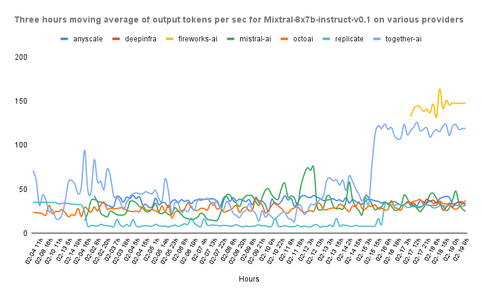
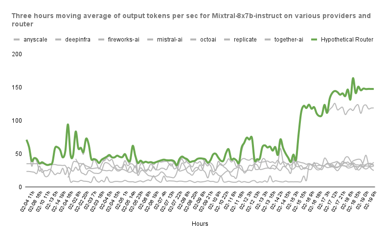

Runtime Dynamic Routing
=======================

When querying models, we usually care for one metric over the rest. This can be cost if prototyping
an application, TTFT if building a bot where responsiveness is key, or output tokens per
second if we want to generate responses as fast as possible. Being able to compare these metrics
among providers mitigates this issue (and that's why we run our `benchmarks! <https://unify.ai/hub>`_).

However, these providers are inherently transient (You can read more about
this `here <https://unify.ai/blog/llm-benchmarks#transient-systems>`_), which
means that they are affected by things like traffic, available devices, changes in
the software or hardware stack, and so on.

Ultimately, this results in a landscape where it's usually not possible to conclude that one
provider is *the best*.

Let's take a look at this graph from our benchmarks.

In this image we can see the **output tokens per second** of different providers
hosting a Mixtral-8x7b public endpoint. We can see how depending on the time of the day,
the "best" provider changes.

When you use runtime dynamic routing, we automatically redirect your request to the provider that
is outperforming the other services at that very moment! You don't need to do anything else ⬇️

How to Use it
-------------

You can quickly try the routing yourself with
`this <https://unify.ai/docs/hub/home/make_your_first_request.html#runtime-dynamic-routing>`_
example. Spoiler: All you need to do is replacing the provider in your query with one of
the available routing modes!

Available Modes
---------------

Currently, we support a set of predefined configurations for the routing:

- :code:`lowest-input-cost`
- :code:`lowest-output-cost`
- :code:`lowest-itl`
- :code:`lowest-ttft`
- :code:`highest-tks-per-sec`

Price Breakpoints
-----------------

Additionally, you have the option to include input or output price breakpoints in each configuration.
This feature enables you to get, for example, the highest tokens per second (:code:`highest-tks-per-sec`)
for any provider whose price falls below a specific threshold. To set this up, just append :code:`<[float][ic|oc]`
to your preferred mode when specifying a provider. Let's illustrate this with a few examples:

- :code:`lowest-itl<0.5ic` - In this case, the request will be routed to the provider with the lowest
  Inter-Token-Latency that has an Input Cost (ic) smaller than 0.5 credits per million tokens.
- :code:`highest-tks-per-sec<1oc` - Likewise, in this scenario, the request will be directed to the provider
  offering the highest Output Tokens per Second, provided their cost is below 1 credit per million tokens.
  Here, (oc) denotes Output Cost.

Depending on the specified threshold, there might be scenarios where no providers meet the criteria,
rendering the request unfulfillable. In such cases, the API response will be a 404 error with the corresponding
explanation. You can detect this and change your policy doing something like:

.. code-block:: python
    :emphasize-lines: 9, 10

    import requests

    url = "https://api.unify.ai/v0/chat/completions"
    headers = {
        "Authorization": "Bearer YOUR_UNIFY_KEY",
    }

    payload = {
        # This won't work since no provider has this price! (yet?)
        "model": "llama-2-70b-chat@lowest-itl<0.001ic"
        "messages": [{
            "role": "user",
            "content": "Hello!"
        }],
    }

    response = requests.post(url, json=payload, headers=headers)
    if response.status_code == 404:
      # We'll get the cheapest endpoint as a fallback
      payload["model"] = "llama-2-70b-chat@lowest-input-cost"
      response = requests.post(url, json=payload, headers=headers)

That's about it! We will be making these modes much flexible in the coming weeks, allowing you to
define more specific and fine-grained rules 🔎
